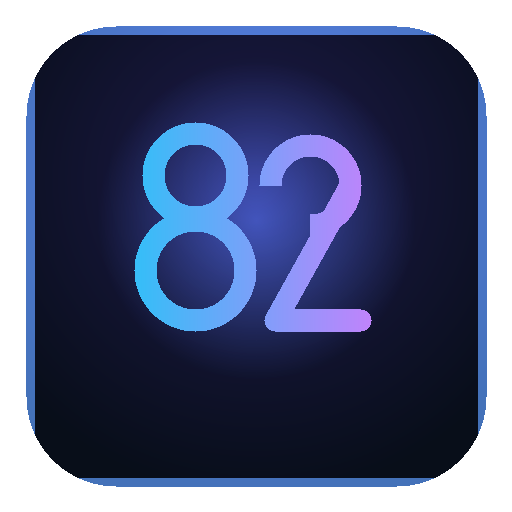

# 825412.xyz 极客多功能工具箱 (Geek Portal & Toolkit)

  

  <strong>专为开发者、极客与日常办公打造的纯前端高颜值多功能工具箱</strong> 
  <em>100% 浏览器本地端侧计算 · 0 字节上传云端 · 免安装 · 免登录 · 极速响应</em>

  
  
  
  

---

## 🌐 在线体验与核心工具矩阵 (Live Tools)

> **官方全功能入口大厅**：👉 **[https://825412.xyz/](https://825412.xyz/)**

| 工具名称 | 在线直达链接 | 核心技术与特色说明 |
| :--- | :--- | :--- |
| ⚡ **网页版 AirDrop (隔空快传)** | **[825412.xyz/airdrop](https://825412.xyz/airdrop)** | 苹果/安卓/Windows/Mac 跨设备免客户端秒传，基于 WebRTC P2P 直连跑满千兆网卡，已实现 **Screen Wake Lock 屏幕常亮与切后台自动断点重连**。 |
| 🎨 **纯离线 AI 智能抠图换底** | **[825412.xyz/tools/ai-matting](https://825412.xyz/tools/ai-matting)** | 浏览器端基于 WebAssembly + ONNX 模型运行，0 字节上云，一寸/二寸证件照一键换蓝红白底，商品白底图透明通道合成。 |
| 🔍 **纯离线 AI OCR 文字识别** | **[825412.xyz/tools/ai-ocr](https://825412.xyz/tools/ai-ocr)** | 纯本地深度学习引擎，不限次数、免登录，截屏/文档直接提取文字，隐私发票与合同 100% 本地安全。 |
| 🖥️ **4K / 8K 显示器验屏工具** | **[825412.xyz/tools/screen-test](https://825412.xyz/tools/screen-test)** | 严格遵照 ISO 9241-307 Class II 标准，纯色验坏点常亮点、IPS 漏光诊断与高刷新率拖影对比。 |
| 🖱️ **8000Hz 鼠标回报率测试** | **[825412.xyz/tools/mouse-test](https://825412.xyz/tools/mouse-test)** | 电竞鼠标超高回报率实时采样曲线监测、微动机械老化双击连击快速排查。 |
| 🪟 **本地人脸隐私打码脱敏** | **[825412.xyz/tools/ai-face-blur](https://825412.xyz/tools/ai-face-blur)** | 纯端侧人脸关键点检测与自动高斯模糊/马赛克，新闻报道与社交媒体隐私合规利器。 |
| 📶 **WiFi 扫码一键连接生成器** | **[825412.xyz/tools/wifi-qr](https://825412.xyz/tools/wifi-qr)** | 离线生成 WPA2/WPA3 WiFi 连接二维码，客人手机相机一扫即连，杜绝口头泄露 WiFi 密码。 |
| 🧰 **极客多功能瑞士军刀** | **[825412.xyz/toolbox](https://825412.xyz/toolbox)** | JWT 深度解析验签、NIST 标准密码熵评估、高强度随机密码生成、时间戳互转、哈希计算器。 |
| 📋 **阅后即焚匿名剪贴板** | **[825412.xyz/clipboard](https://825412.xyz/clipboard)** | 集成去中心化短链接生成，支持自定义失效时间，本地自动维护历史记录。 |
| 🪝 **公网 Webhook 调试桩** | **[825412.xyz/webhook](https://825412.xyz/webhook)** | 免搭服务器调试第三方回调，支持签名比对、幂等测试与实时响应模拟。 |

---

## 🎨 视觉与交互规范 (Apple Bento Grid Aesthetic)

* **黑曜石磨砂拟态 (Obsidian Glassmorphism)**：以 deep navy (`#090d16`) 为底，配合 `backdrop-filter: blur(24px)` 磨砂玻璃容器与微渐变霓虹青紫光效。
* **移动端丝滑保活体验**：
  * **Screen Wake Lock API**：大文件投送时手机屏幕自动保持常亮，防止系统休眠断流。
  * **Page Visibility 自动唤醒**：手机切应用（如切换微信或图库）返回后，毫秒级自动重整 P2P 拓扑并重连，杜绝意外中断。
* **双语与国际化 (i18n)**：全站原生内置中英文自动切换支持。

---

## 🔒 隐私与离线安全声明 (Zero-Cloud Architecture)

* **0 字节隐私泄露**：所有文件投送（WebRTC P2P）、图像 AI 抠图处理、OCR 识别均在用户本地浏览器内存沙盒中完成，数据绝不经过第三方服务器存储。
* **零侵入式追踪**：全站坚决不注入任何三方用户行为采集代码，保护开发者隐私尊严。

---

## 🚀 部署指引 (Deploy Your Own)

本项目为纯静态前端架构（Vanilla HTML5 / CSS3 / ES Modules），无需任何后端 Node/Python 运行环境，可零成本永久免费托管于各类 CDN 与 Pages 平台：

### 部署到 Cloudflare Pages
1. 登录 [Cloudflare Dashboard](https://dash.cloudflare.com/)。
2. 进入 **Workers & Pages** -> **Create application** -> **Pages** -> **Connect to Git**。
3. 选择本仓库 `ln8254/825412-portal`，Build command 留空，输出目录填 `/`。
4. 部署完成后，在 **Custom domains** 绑定您的自定义域名即可。

### 部署到 Vercel
1. 访问 [Vercel](https://vercel.com/) 并导入 GitHub 仓库。
2. Framework Preset 选择 **Other**，点击 **Deploy** 即可秒级上线。

---

## 📄 开源许可证

本项目基于 [MIT License](LICENSE) 开源。欢迎提交 Issue 或 Pull Request！

*官网门户：[https://825412.xyz/](https://825412.xyz/)*
